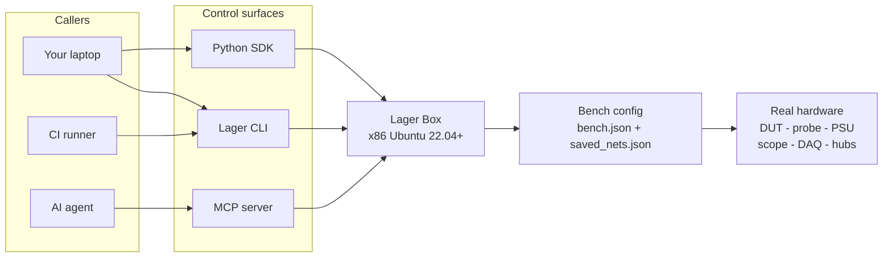

# Lager

**The bench, as data. The tests, as functions. The runs, reproducible.**

Lager turns every hardware operation in your firmware loop — flash, power-cycle, RTT/UART capture, scope and DAQ measurement, instrument control — into a named, networked primitive. Same names, same API, same exit codes from your laptop, your CI pipeline, or an AI agent — so the HIL test that passes on your desk is the same one that gates the merge on the runner.

Most embedded CI stops before the part that actually breaks: the interaction between firmware and physical hardware. Release confidence still comes from "we ran it on the bench once before we tagged" instead of from a green check. Lager closes that gap — the bench becomes a programmable peer of the rest of your release process.

[](https://pypi.org/project/lager-cli/)
[](https://pypi.org/project/lager-cli/)
[](LICENSE)
[](https://docs.lagerdata.com)

---

## The pain

Firmware is increasingly software-like — modern toolchains, type systems, package managers, reproducible builds. The workflow around it isn't.

- The "real" test still requires a specific engineer, a specific desk, a specific board revision, a specific probe, and a specific power supply.
- Tests stop at unit tests, host-side mocks, or hand-run scripts. The interesting failures show up at the firmware-hardware boundary: boot timing, brownouts, watchdogs, peripheral sequencing, DMA, sleep/wake, radio behavior after reset.
- When something does fail on the bench, logs and measurements live in a terminal scrollback that someone closed an hour ago.
- CI cannot meaningfully validate any of this. The hardware-dependent half of the system — boot timing, brownouts, watchdogs, peripheral sequencing, sleep/wake, radio behavior after reset — never sees the merge gate. A HIL regression isn't bisectable, isn't reproducible across runners, and shows up in production instead of in a failed CI job.

Lager exists because every embedded team eventually rebuilds the same bespoke bench-orchestration scripts, badly.

---

## What Lager gives you

- **Named benches and named nets.** Declare your bench once in JSON on the box ([`/etc/lager/bench.json`](box/lager/mcp/engine/bench_loader.py) + `/etc/lager/saved_nets.json`) and address everything by name from then on. Same names in the CLI, the Python SDK, and over MCP.
- **Firmware flash.** `lager debug <net> flash --elf|--hex|--bin` ships the binary to the box and programs the target through the attached debug probe. J-Link (`JLinkExe loadfile`) and OpenOCD (`openocd program`) are both first-class backends, selected automatically from the probe's USB VID ([`box/lager/debug/probes.py`](box/lager/debug/probes.py), [`box/lager/debug/jlink.py`](box/lager/debug/jlink.py), [`box/lager/debug/openocd.py`](box/lager/debug/openocd.py), [`box/lager/debug/service.py`](box/lager/debug/service.py)). ELF defaults from any toolchain — including `cargo build` — work as-is.
- **Reset and power-cycle.** SWD reset (halt or run-no-halt) via the debug probe, plus real power-cycle through the bench PSU or per-port USB-hub power ([`box/lager/automation/usb_hub/`](box/lager/automation/usb_hub/)).
- **RTT and UART log capture.** First-class RTT with auto-discovery of the control block over either debug backend ([`box/lager/debug/api.py`](box/lager/debug/api.py), [`box/lager/debug/openocd.py`](box/lager/debug/openocd.py)); UART streaming over WebSocket ([`box/lager/http_handlers/uart.py`](box/lager/http_handlers/uart.py)) and `pyserial` in scripts.
- **Instruments under one API.** Power supplies, electronic loads, oscilloscopes, DAQs, watt meters (Yocto-Watt, Nordic PPK2, Joulescope), thermocouples, USB hubs, robot arms — see the [supported hardware](#supported-hardware) table.
- **Four ways to drive the same bench, one vocabulary.** CLI (`lager-cli` on PyPI), Python SDK (`from lager import Net, NetType`), HTTP/WebSocket API on the box at `:5000`, and an MCP server on `:8100`. Net names are identical across all four.
- **CI as a first-class caller.** `lager python` exit codes propagate, environment auto-detection ([`cli/context/ci_detection.py`](cli/context/ci_detection.py)) handles GitHub Actions / GitLab / Drone / Bitbucket / Jenkins out of the box, and the same net names that work on your laptop work on the runner. Bench access becomes the merge gate. See [For teams running HIL in CI](#for-teams-running-hil-in-ci).
- **Agent-ready.** The MCP server lets Cursor, Claude Desktop, or your own agent introspect the bench and run real hardware steps without a shell — `discover_bench` returns named nets and capabilities, then the agent writes Python and runs it with `lager python`. See the [MCP section](#mcp-server-optional-for-agent-workflows).
- **Artifacts that survive the test.** Logs, measurements, and traces come back as data instead of evaporating in a terminal.

---

## Quickstart

> **~5 minutes once you have a Lager box.** First-time box provisioning (a fresh Ubuntu 22.04+ machine + `lager install`) takes another 20–30 min — see the [deployment guide](docs/reference/deployment/README.md). Lager runs against real hardware; there is no zero-hardware demo in this repo today.

### What a bench looks like

The bench is two JSON files on the box. From there, every CLI, SDK, and MCP call addresses hardware by name:

```json
// /etc/lager/saved_nets.json — one entry per named connection on the bench
[
  {"name": "vbat",    "role": "power-supply", "instrument": "rigol_dp800", "channel": "1"},
  {"name": "swd0",    "role": "debug",        "instrument": "jlink",       "channel": "NRF52840_XXAA"},
  {"name": "uart1",   "role": "uart",         "instrument": "usb",         "channel": "/dev/ttyUSB0"},
  {"name": "imu_pwr", "role": "usb",          "instrument": "acroname",    "channel": "3"}
]
```

`lager nets add-all` discovers attached instruments and writes this file for you; you can hand-edit it too. The shape is the same one `_net_from_raw` consumes in [box/lager/mcp/engine/bench_loader.py](box/lager/mcp/engine/bench_loader.py).

### 1. Install the CLI on your laptop

```bash
pip install lager-cli
```

### 2. Provision a box

Any x86 machine running Ubuntu 22.04+ becomes a Lager box.

```bash
lager install --ip <BOX_IP>
lager boxes add --name my-box --ip <BOX_IP>
lager hello --box my-box
```

`lager hello` hits `http://<box>:5000/hello` and confirms the box services are up ([cli/commands/box/hello.py](cli/commands/box/hello.py)).

### 3. Declare what's wired up

```bash
lager nets add-all --box my-box   # discover instruments and offer to save them
lager nets list    --box my-box
```

### 4. Talk to the hardware

```bash
lager supply vbat enable --box my-box
lager supply vbat voltage 3.3 --box my-box
lager debug swd0 flash --elf target/thumbv7em-none-eabihf/release/firmware --box my-box
lager debug swd0 reset --box my-box
lager uart --box my-box --baudrate 115200
```

### 5. Or the same thing from Python

```python
from lager import Net, NetType

vbat = Net.get("vbat", type=NetType.PowerSupply)
swd  = Net.get("swd0", type=NetType.Debug)

vbat.voltage(3.3); vbat.enable()
swd.flash(elf="firmware.elf")
swd.reset(halt=False)
```

Run that file against the box with:

```bash
lager python --serial my-box hil_smoke.py
```

`lager python` syncs your project to the box and executes the script there, so anything in your repo — pytest, your test framework, custom modules — is available. See [docs/examples/demo_script.py](docs/examples/demo_script.py) and [test/api/communication/test_debug_comprehensive.py](test/api/communication/test_debug_comprehensive.py) for fuller examples.

---

## For teams running HIL in CI

If you treat CI as part of the release process — not a separate ritual someone runs by hand before tagging — Lager is built for you. The same `lager python` script that runs on your laptop runs on a CI runner against a real board, with the same net names, the same API, and the same exit codes. A failed assertion is a failed job. Bench access is wired into the merge gate the same way unit tests are.

What changes for a team that already invests in CI:

- **Hardware tests live in the same repo, on the same branch, as the firmware.** No more "the smoke test is on Sarah's laptop." Versioned, reviewed, blamable, replayable.
- **HIL runs on the PR, not post-merge.** Boot timing, brownouts, watchdogs, peripheral sequencing, sleep/wake, radio-after-reset behavior — caught before merge, on the runner, with logs and measurements attached to the failed job.
- **Releases gated on real-hardware evidence.** Tag a release → CI flashes the candidate firmware on a real DUT, runs the regression suite, attaches the captured RTT/UART/scope/current traces as artifacts. The green check on the tag means the bench saw the firmware behave, not that someone remembered to run the smoke test.
- **Determinism across runners.** The bench lives on the box, not on the runner. Self-hosted runner, GitHub-hosted runner, developer laptop, on-call engineer's laptop — `--serial <BOX>` always resolves to the same physical bench. A passing run on one machine is a passing run on every machine.
- **Flake triage with evidence.** Logs, measurements, and traces come back as artifacts on the CI job, not as terminal scrollback someone already closed. Bisecting a HIL regression looks like bisecting a unit-test regression — `git bisect run lager python ...` works the way you'd hope.
- **The bench is the bottleneck, not the runner.** A Lager box can fan multiple concurrent debug probes / DUTs on per-slot port windows ([`box/lager/debug/probes.py`](box/lager/debug/probes.py)), so a single box can serve PR jobs, nightly regressions, and developer ad-hoc runs without serializing the team behind one DUT.

Any GitHub Actions / GitLab / Drone / Bitbucket / Jenkins runner becomes a HIL runner. The CLI detects the environment automatically ([`cli/context/ci_detection.py`](cli/context/ci_detection.py)) and `lager python` exit codes propagate, so a failed assertion fails the job.

```yaml
# .github/workflows/hil.yml
name: HIL smoke
on: [pull_request]
jobs:
  hil:
    runs-on: ubuntu-latest
    steps:
      - uses: actions/checkout@v4
      - run: pip install lager-cli
      - run: cargo build --release --target thumbv7em-none-eabihf
      - run: lager hello --box ${{ secrets.LAGER_BOX }}   # fail fast if the bench is down
      - run: |
          lager python --serial ${{ secrets.LAGER_BOX }} \
            tests/hil_smoke.py \
            --add-file target/thumbv7em-none-eabihf/release/firmware
```

The runner needs network reach to the box (Tailscale, VPN, or LAN). Auth lives in the box record on the runner side; in CI you point `--serial` at the box name and rely on credentials provisioned during setup. The `lager hello` step is a cheap pre-flight check — if the bench is offline, the job fails in under a second instead of after a 30-second flash timeout.

---

## For Rust embedded teams

Rust has made firmware feel like serious software. Cargo, type-checked HALs, defmt, probe-rs, and frameworks like Embassy and RTIC have closed a lot of the gap with general-purpose software development.

But eventually the firmware has to run on the board. The hard failures still happen at the boundary between code and hardware: boot timing, power rails, brownouts, watchdogs, radio behavior, sensor state, peripheral sequencing, DMA, sleep/wake transitions, and the specific way a particular silicon revision responds after reset.

Lager gives Rust embedded teams a programmable layer around the bench so a test can flash the firmware, start log capture, reset or power-cycle the DUT, drive external inputs, control instruments, measure current, collect artifacts, and fail with evidence. It does not replace Embassy, RTIC, probe-rs, defmt, RTT, pyOCD, or your vendor SDK. It orchestrates the bench around them.

**How Lager fits with your existing Rust toolchain.**

- **The bench layer is independent of your flash tool.** PSU control, USB-hub power-cycling, RTT capture, scope and DAQ measurement, current measurement (PPK2, Joulescope, Yocto-Watt), and CI integration are useful even if your team's flash flow stays `cargo embed` / `probe-rs run`. Drive them from `lager python` scripts alongside your existing probe-rs invocation.
- **cargo-built ELFs flash directly** via `lager debug <net> flash --elf target/.../firmware` if you want Lager to do the flashing too. Goes through `JLinkExe loadfile` ([box/lager/debug/jlink.py](box/lager/debug/jlink.py)) or `openocd program` ([box/lager/debug/openocd.py](box/lager/debug/openocd.py)) depending on the probe — Lager doesn't care which toolchain produced the ELF.
- **defmt over RTT.** Lager surfaces RTT as raw bytes over both debug backends ([box/lager/debug/api.py](box/lager/debug/api.py), [box/lager/debug/openocd.py](box/lager/debug/openocd.py)). Pipe stdout into `defmt-print -e firmware.elf` to decode; the CLI handles `SIGPIPE` for exactly this pattern ([cli/commands/development/debug/commands.py](cli/commands/development/debug/commands.py)).
- **GDB.** `lager debug <net> gdbserver` starts a GDB server on the box and exposes the port — `JLinkGDBServerCLExe` for J-Link probes ([box/lager/debug/gdbserver.py](box/lager/debug/gdbserver.py)), `openocd` for ST-Link / RP2040 Picoprobe / CMSIS-DAP / FTDI ([box/lager/debug/openocd.py](box/lager/debug/openocd.py)). Point `rust-gdb` or `arm-none-eabi-gdb` at it.
- **Embassy, RTIC, embedded-hal, vendor HALs.** Framework-agnostic — Lager sees a target chip and an ELF.
- **Two first-class debug backends: J-Link and OpenOCD.** SEGGER probes route to J-Link; ST-Link V2/V2-1/V3, Raspberry Pi Debug Probe (RP2040 Picoprobe / CMSIS-DAP), ARM DAPLink, Atmel EDBG, FTDI FT232H/FT2232H/FT4232H, and Olimex ARM-USB-OCD-H route to OpenOCD. Routing is automatic from the probe's USB VID ([box/lager/debug/probes.py](box/lager/debug/probes.py)); both backends share the same `connect` / `flash` / `reset` / `gdbserver` / `memrd` / RTT surface. probe-rs and pyOCD aren't integrated as backends today — if you want a single command that does both bench orchestration and a probe-rs flash, install probe-rs on the box via `lager box config cargo` and call it from a `lager python` script. PRs welcome.

**What a Rust HIL test typically does on Lager.** Flash an Embassy or RTIC firmware image, capture defmt logs over RTT, drive a GPIO or supply rail as a stimulus, power-cycle the DUT, measure sleep current with a PPK2 or Joulescope net, detect a panic or watchdog reset or unexpected log line, and save the captured logs and measurements as artifacts the next engineer can replay.

---

## Writing a HIL test

A small smoke test that flashes a Rust firmware image, resets the board, and asserts on RTT output. Assumes `debug1` is declared on the bench (see [test/api/communication/test_debug_comprehensive.py](test/api/communication/test_debug_comprehensive.py) for a fuller pattern; `RTT` shape from [box/lager/debug/api.py](box/lager/debug/api.py)).

```python
import time
from lager import Net, NetType

debug = Net.get("debug1", type=NetType.Debug)

debug.connect()
debug.flash(elf="firmware.elf")
debug.reset(halt=False)

with debug.rtt() as rtt:
    deadline = time.monotonic() + 10
    seen = b""
    while time.monotonic() < deadline:
        chunk = rtt.read_some(timeout=0.25)
        if chunk:
            seen += chunk
            if b"boot_ok" in seen:
                break
    assert b"boot_ok" in seen, f"no boot frame in {len(seen)} bytes"
```

`seen` is raw RTT bytes. For defmt firmware, pipe it through `defmt-print -e firmware.elf` or decode in-process with the `defmt-decoder` crate / Python bindings. The example asserts on a sentinel substring so it works for both raw and defmt logs.

Run it from your laptop or from CI:

```bash
lager python --serial my-box hil_smoke.py --add-file firmware.elf
```

`--add-file` ships the binary alongside the script. Exit code propagates back, so a failed assertion fails the CI step.

---

## Architecture



Box services speak HTTP/WebSocket on port `5000` ([box/lager/box_http_server.py](box/lager/box_http_server.py)); the MCP server runs alongside on port `8100` ([box/lager/mcp/server.py](box/lager/mcp/server.py)). Bench state lives in JSON on the box (`/etc/lager/bench.json`, `/etc/lager/saved_nets.json`) and is the single source of truth every control surface reads from.

---

## What Lager is / what it is not

**Lager is.** Bench orchestration. A unified, named-resource API over instruments, debug probes, and DUTs. A way to make HIL tests reproducible across people, machines, and CI. A way to share a single bench across a team without everyone needing the same local lab setup.

**Lager is not.** A firmware framework. A replacement for Embassy, RTIC, probe-rs, defmt, RTT, pyOCD, or vendor SDKs. A simulator or a way to avoid real hardware. A dashboard-only observability product. A hosted-cloud requirement — you can run everything on machines you own. A magic auto-generated-driver system. A way to skip understanding the hardware.

It complements the embedded tools you already trust by orchestrating the physical bench around them.

**Hosting model.** Lager is Apache-2.0 open source and runs entirely on hardware you own — no cloud dependency ([SECURITY.md](SECURITY.md) L71). Commercial control planes that add org/RBAC/SSO, audit logging, and bench scheduling on top of Lager — for teams running fleets of boxes — are listed on the [Professional Services directory](https://lagerdata.com/professional-services).

---

## Supported hardware

| Category | Devices |
|----------|---------|
| **Power Supplies** | Rigol DP800, Keithley 2200/2280, Keysight E36200/E36300 |
| **Battery Simulators** | Keithley 2281S |
| **Solar Simulators** | EA PSI/EL series |
| **Electronic Loads** | Rigol DL3021 |
| **Oscilloscopes** | Rigol MSO5000 series, PicoScope 2000/2000a |
| **DAQ / I/O** | LabJack T7 (ADC / DAC / GPIO) |
| **Temperature** | Phidget thermocouples |
| **Power Meters** | Yocto-Watt, Nordic PPK2, Joulescope |
| **USB Hubs** | Acroname, YKUSH (per-port power) |
| **Debug Probes** | SEGGER J-Link, ST-Link V2 / V2-1 / V3, Raspberry Pi Debug Probe (RP2040 Picoprobe / CMSIS-DAP), ARM DAPLink, Atmel EDBG / mEDBG, FTDI FT232H / FT2232H / FT4232H, Olimex ARM-USB-OCD-H. See note below. |
| **Robot Arms** | Rotrics Dexarm |

**On debug probes.** Lager has two first-class debug backends: J-Link (`JLinkExe` / `JLinkGDBServerCLExe`, [`box/lager/debug/jlink.py`](box/lager/debug/jlink.py)) for SEGGER probes, and OpenOCD ([`box/lager/debug/openocd.py`](box/lager/debug/openocd.py)) for ST-Link, RP2040 Picoprobe / CMSIS-DAP, DAPLink, Atmel EDBG, and FTDI-based adapters. Routing is automatic from the probe's USB VID ([`box/lager/debug/probes.py`](box/lager/debug/probes.py)); both backends share the same `connect` / `flash` / `reset` / `gdbserver` / `memrd` / RTT surface, run concurrently on per-slot port windows, and are driven by identical CLI / SDK / MCP commands. FT4232H needs a user-supplied OpenOCD config (its four MPSSE channels can't be auto-mapped) — attach one with `lager nets set-script --backend openocd`. probe-rs and pyOCD aren't integrated as backends — install them on the box (e.g. `lager box config cargo` for probe-rs) and invoke them from `lager python` scripts.

Adding a driver follows the dispatcher pattern in [box/lager/](box/lager/) — PRs welcome.

---

## CLI surface

| Group | Commands |
|-------|----------|
| **Power** | `supply`, `battery`, `solar`, `eload` |
| **Measurement** | `adc`, `dac`, `gpi`, `gpo`, `scope`, `logic`, `thermocouple`, `watt`, `energy` |
| **Communication** | `uart`, `i2c`, `spi`, `ble`, `blufi`, `wifi`, `usb` |
| **Development** | `debug`, `arm`, `python`, `devenv`, `terminal` |
| **Box** | `hello`, `status`, `boxes`, `instruments`, `nets`, `ssh` |
| **Utility** | `defaults`, `update`, `pip`, `webcam`, `exec`, `logs`, `binaries`, `install` |

`lager --help` or `lager <group> --help` for everything. Full reference: [docs.lagerdata.com/reference/cli](https://docs.lagerdata.com/reference/cli).

---

## MCP server (optional, for agent workflows)

Lager ships an MCP server on every box so agents (Cursor, Claude Desktop, your own) can introspect the bench and run real hardware steps directly, without a shell. We use this in-house for agentic AI workflows where a model needs to pick the right net for a test before writing or running it — discovery first, action second.

Add it to your agent's config:

```json
{
  "mcpServers": {
    "lager": { "url": "http://<box-ip>:8100/mcp" }
  }
}
```

The tools actually registered today ([`box/lager/mcp/server.py`](box/lager/mcp/server.py)):

| Tool | What it does |
|------|--------------|
| `discover_bench` | Returns the bench (DUT slots, instruments, nets, capability summary) as JSON. Pass a `net_name` to expand one net plus its capabilities. |
| `assess_suitability` | Given a test type, returns whether the bench can run it, missing roles, candidate nets, and an explanation. |
| `plan_firmware_test` | Returns a structured test plan tying available nets to a firmware-test goal. |
| `get_test_example` | Finds runnable example scripts in `test/api/` by keyword. |
| `quick_io` | Single-net spot-check (e.g. "what's the voltage on `vbat` right now?"). |
| `install_dependency` | `pip install` on the box for things the script needs. |
| `box_manage` | Box admin (config reload, etc.). |

For everything beyond `quick_io`, the agent writes a Python file and runs it with `lager python` — the same surface a human uses. Bench discovery + Python execution is the loop.

Port defaults from [`box/lager/mcp/config.py`](box/lager/mcp/config.py) (`LAGER_MCP_PORT=8100`, `LAGER_MCP_HOST=0.0.0.0`).

<details>
<summary>Connectivity check and Python client</summary>

```bash
curl http://<box-ip>:8100/mcp
docker exec lager tail -20 /tmp/lager-mcp-server.log
```

```python
from mcp import ClientSession
from mcp.client.streamable_http import streamablehttp_client

async with streamablehttp_client("http://<box-ip>:8100/mcp") as (read, write, _):
    async with ClientSession(read, write) as session:
        await session.initialize()
        tools = await session.list_tools()
        result = await session.call_tool("discover_bench", {})
```

</details>

---

## Repo layout

```
lager/
├── cli/                  # Python Click CLI (pip install lager-cli) + deployment scripts
├── box/                  # Software that runs on the Lager box
│   ├── lager/            # Python services: nets, dispatchers, MCP server, HTTP/WS handlers
│   └── oscilloscope-daemon/  # Rust WebSocket/WebTransport scope streamer
├── test/                 # Integration (bash) + API (pytest) + unit tests
└── docs/                 # Mintlify docs source + deployment reference
```

Deeper architecture — dispatcher pattern, caching, deployment internals, per-driver layouts — lives at [docs.lagerdata.com](https://docs.lagerdata.com).

---

## Development

```bash
# CLI (editable install)
cd cli && pip install -e . && lager --help

# Box services (deploy to a target host)
lager install --ip <box-ip>

# Oscilloscope daemon (Rust 1.85+, edition 2024)
cd box/oscilloscope-daemon && cargo build --release

# Tests
cd test && pytest unit/                              # no hardware
./integration/power/supply.sh <box-ip> <net-name>    # hardware required
```

---

## Docs and community

- [Getting started](https://docs.lagerdata.com/essentials/quickstart)
- [CLI reference](https://docs.lagerdata.com/reference/cli)
- [Python SDK reference](https://docs.lagerdata.com/reference/python)
- Issues and discussions: [github.com/lagerdata/lager](https://github.com/lagerdata/lager)

---

## License

Apache License 2.0 — Lager Data. See [LICENSE](LICENSE) for details.
