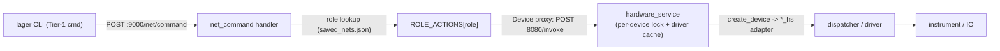

# Tier-1 net coverage on the box HTTP API (:9000)

This report tracks which `lager` CLI net commands drive the box over the warm
HTTP server on port 9000 versus the legacy per-call Python exec path on port
5000 (upload a script under `cli/impl/*.py`, spawn a process, `import lager`).

The motivation is the upcoming Rust crate: firmware developers should be able to
write cargo tests directly against the box's HTTP API. Every Tier-1
instrument/IO net therefore needs a stable `:9000` endpoint, and the CLI must
exercise that same endpoint (no Python-under-the-hood) so the CLI and the crate
share one contract.

## How Tier-1 commands reach the box

Generic Tier-1 roles go through `POST :9000/net/command`
([box/lager/http_handlers/net_command.py](../../box/lager/http_handlers/net_command.py)),
dispatched from the shared CLI helper `post_net_command`
([cli/core/net_helpers.py](../../cli/core/net_helpers.py)). Net listing uses
`fetch_nets` -> `GET :9000/nets/list` (falls back to `/uart/nets/list` on older
boxes). Supply, battery, and USB keep their dedicated `:9000` command endpoints;
UART uses the `:9000` WebSocket stream plus `:9000` HTTP for discovery/listing.

`ROLE_ACTIONS` currently registers: `gpio`, `adc`, `dac`, `thermocouple`,
`watt-meter`, `eload`, `spi`, `i2c`, `energy-analyzer`.

### Every Tier-1 role runs through hardware_service

The `/net/command` handler does not touch hardware in the `box_http_server`
process. For each role it builds a `Device` proxy
([box/lager/nets/device.py](../../box/lager/nets/device.py)) and calls the
instrument method via `POST :8080/invoke` — the same single-owner path
supply/battery already use.
[hardware_service](../../box/lager/hardware_service.py) owns and caches the
driver per physical device and serializes every call under a per-device lock, so
concurrent `:9000` requests (e.g. parallel cargo tests from the Rust crate) can
never interleave I/O on one instrument.

- **VISA instruments (eload)** lock on the VISA address, like supply/battery.
- **Non-VISA devices (adc/dac/gpio/thermocouple/watt/energy/spi/i2c)** have no
  VISA address, so each net supplies an explicit `device_id` — a stable physical
  identity (e.g. `labjack:…`, `joulescope:…`) that is *shared* by every net and
  role on the same hardware. hardware_service locks on `device_id`, so a LabJack
  driving GPIO + ADC + SPI, or a Joulescope shared by a watt-meter and an
  energy-analyzer net, serialize across roles. The driver cache still keeps a
  distinct instance per net (different pins/channels); only the lock is shared.

Each role maps to a role-unique `create_device` factory module
(`adc_hs`, `dac_hs`, `gpio_hs`, `thermocouple_hs`, `watt_hs`, `energy_hs`,
`spi_hs`, `i2c_hs` at the top of the `lager` package) that hardware_service
resolves via its `lager.{device}` import search. Each adapter is a thin shim
over the role's existing dispatcher, so behavior matches the former
`lager <cmd>` path. Multi-step transactions (eload mode+setpoint, gpio toggle,
spi transfer) are single composite `/invoke` calls, so they complete atomically
under one lock acquisition. Long-running calls (gpio `wait_for_level`, watt /
energy integration windows) widen the `Device` proxy HTTP timeout to cover the
device-side duration.

## Per-role status

| Role | CLI command | Transport | :5000 Python path? |
| --- | --- | --- | --- |
| supply | `lager supply` | `:9000/supply/command` (+ WS TUI) | Removed |
| battery | `lager battery` | `:9000/battery/command` (+ WS TUI) | Removed |
| eload | `lager eload` | `:9000/net/command` | Removed |
| adc | `lager adc` | `:9000/net/command` | Removed |
| dac | `lager dac` | `:9000/net/command` | Removed |
| gpi | `lager gpi` | `:9000/net/command` (`input`, `wait_for_level`) | Removed |
| gpo | `lager gpo` | `:9000/net/command` (`output`) | Removed |
| thermocouple | `lager thermocouple` | `:9000/net/command` | Removed |
| watt-meter | `lager watt` | `:9000/net/command` (`power`/`current`/`voltage`/`all`) | Removed |
| energy-analyzer | `lager energy` | `:9000/net/command` | Removed |
| spi | `lager spi` | `:9000/net/command` (`config`/`write`/`read`/`read_write`) | Removed |
| i2c | `lager i2c` | `:9000/net/command` (`config`/`scan`/read/write) | Removed |
| usb | `lager usb` | `:9000/usb/command` | Removed |
| uart | `lager uart` | `:9000` WS stream + `:9000/instruments/list` discovery | Removed (dead exec helper deleted) |

All Tier-1 roles are 9000-only. There is intentionally no `:5000` fallback in
any Tier-1 command; an unreachable or outdated box surfaces a clear error rather
than silently falling back.

## Intentionally NOT on :9000/net/command (out of scope)

These commands still use the `:5000` exec path and are out of scope for the
Tier-1 migration. They are complex, stateful, or streaming workflows that do not
fit the simple request/response `/net/command` contract:

- `lager scope`, `lager scope stream` ([measurement/scope.py](../../cli/commands/measurement/scope.py)) - large streaming/capture workflow.
- `lager logic` ([measurement/logic.py](../../cli/commands/measurement/logic.py)) - logic-analyzer capture/trigger/cursor.
- `lager solar` ([power/solar.py](../../cli/commands/power/solar.py)) - solar-array emulation mode.
- `lager wifi` / `router` / `blufi` / `ble` ([communication/](../../cli/commands/communication/)) - connectivity provisioning via `run_impl_script`.
- `lager webcam` ([utility/webcam.py](../../cli/commands/utility/webcam.py)) - image capture.
- `lager net ...` management, `box config`, `box instruments`, `debug` ([box/](../../cli/commands/box/)) - net CRUD / box config / debug helpers.
- `binaries`, `install-wheel`, `update`, `lock`/`unlock`, `diagnose` - box service endpoints that legitimately live on `:5000` (health, binaries, lock, diagnose) or are dev tooling.

## Regression guards

- Box: [test/unit/box/test_net_command_handler.py](../../test/unit/box/test_net_command_handler.py) covers each role/action through a mocked `Device` proxy, including gpio `wait_for_level` (timeout -> 502), watt-meter `current`/`all`, eload `state`, spi `write`/`config`, and i2c `config`/`scan` range.
- Box: [test/unit/box/test_hardware_service_retry.py](../../test/unit/box/test_hardware_service_retry.py) `DeviceIdLockTests` covers the shared `device_id` lock — two roles on one physical device get distinct cache entries but a single shared lock, with fallback to the cache-key lock when no `device_id`/`address` is present.
- CLI: [test/unit/cli/test_net_9000_migration.py](../../test/unit/cli/test_net_9000_migration.py) covers `post_net_command`/`fetch_nets` HTTP behavior, per-command action dispatch, and a parametrized guard asserting no Tier-1 command module imports `run_python_internal` / `run_impl_script` / `run_backend`.
- CLI: [test/unit/cli/test_watt_subcommands.py](../../test/unit/cli/test_watt_subcommands.py) covers watt output formatting over the 9000 path.
