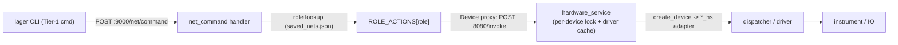

# Tier-1 net coverage on the box HTTP API (:9000)

This report tracks which `lager` CLI net commands drive the box over the warm
HTTP server on port 9000 versus the legacy per-call Python exec path on port
5000 (upload a script under `cli/impl/*.py`, spawn a process, `import lager`).

The motivation is the upcoming Rust crate: firmware developers should be able to
write cargo tests directly against the box's HTTP API. Every Tier-1
instrument/IO net therefore needs a stable `:9000` endpoint, and the CLI must
exercise that same endpoint (no Python-under-the-hood) so the CLI and the crate
share one contract.

## How Tier-1 commands reach the box

Generic Tier-1 roles go through `POST :9000/net/command`
([box/lager/http_handlers/net_command.py](../../box/lager/http_handlers/net_command.py)),
dispatched from the shared CLI helper `post_net_command`
([cli/core/net_helpers.py](../../cli/core/net_helpers.py)). Net listing uses
`fetch_nets` -> `GET :9000/nets/list` (falls back to `/uart/nets/list` on older
boxes). Supply, battery, and USB keep their dedicated `:9000` command endpoints;
UART uses the `:9000` WebSocket stream plus `:9000` HTTP for discovery/listing.

`ROLE_ACTIONS` currently registers: `gpio`, `adc`, `dac`, `thermocouple`,
`watt-meter`, `eload`, `spi`, `i2c`, `energy-analyzer`, `arm`, `webcam`,
`router` (+ `mikrotik` alias). The `/status` capability block advertises the
role list as `netCommandRoles` so clients can detect arm/webcam/router support
without version sniffing.

Box-level capabilities that drive the box's own hardware rather than a saved
net get dedicated endpoints, mirroring `/usb/command`: `POST /ble/command`,
`POST /wifi/command`, and `POST /blufi/command`
([box/lager/http_handlers/{ble,wifi,blufi}.py](../../box/lager/http_handlers/)),
advertised as `bleCommand` / `wifiCommand` / `blufiCommand`. The CLI reaches
them through `post_box_command` in
[cli/core/net_helpers.py](../../cli/core/net_helpers.py). BLE and BluFi share
one Bluetooth adapter, so both handlers serialize under a shared adapter lock
and run their bleak coroutines on a dedicated event-loop thread; WiFi actions
serialize under a wlan lock around the shared `lager.protocols.wifi`
subprocess wrappers.

### Every Tier-1 role runs through hardware_service

The `/net/command` handler does not touch hardware in the `box_http_server`
process. For each role it builds a `Device` proxy
([box/lager/nets/device.py](../../box/lager/nets/device.py)) and calls the
instrument method via `POST :8080/invoke` — the same single-owner path
supply/battery already use.
[hardware_service](../../box/lager/hardware_service.py) owns and caches the
driver per physical device and serializes every call under a per-device lock, so
concurrent `:9000` requests (e.g. parallel cargo tests from the Rust crate) can
never interleave I/O on one instrument.

- **VISA instruments (eload)** lock on the VISA address, like supply/battery.
- **Non-VISA devices (adc/dac/gpio/thermocouple/watt/energy/spi/i2c)** have no
  VISA address, so each net supplies an explicit `device_id` — a stable physical
  identity (e.g. `labjack:…`, `joulescope:…`) that is *shared* by every net and
  role on the same hardware. hardware_service locks on `device_id`, so a LabJack
  driving GPIO + ADC + SPI, or a Joulescope shared by a watt-meter and an
  energy-analyzer net, serialize across roles. The driver cache still keeps a
  distinct instance per net (different pins/channels); only the lock is shared.

Each role maps to a role-unique `create_device` factory module
(`adc_hs`, `dac_hs`, `gpio_hs`, `thermocouple_hs`, `watt_hs`, `energy_hs`,
`spi_hs`, `i2c_hs` at the top of the `lager` package) that hardware_service
resolves via its `lager.{device}` import search. Each adapter is a thin shim
over the role's existing dispatcher, so behavior matches the former
`lager <cmd>` path. Multi-step transactions (eload mode+setpoint, gpio toggle,
spi transfer) are single composite `/invoke` calls, so they complete atomically
under one lock acquisition.

### Timeout budgets for long-running actions

Actions that block on the box for a caller-controlled duration must widen BOTH
HTTP legs past that duration, or a healthy request dies with a client-side
ReadTimeout:

- **CLI -> box (:9000)**: `post_net_command(http_timeout=...)`. Quick commands
  use the 10s default; energy uses `max(30, duration + 30)`, watt uses
  `max(30, duration + 20)`, and gpi `--wait-for` uses `--timeout + 20` (or no
  client timeout at all when `--timeout` is omitted — an unbounded wait,
  matching the old :5000 behavior).
- **box -> hardware_service (:8080)**: the `Device` proxy timeout, set per
  handler to `duration + margin` (energy/watt) or the wait timeout + margin
  (gpio; a 24h stand-in when unbounded).

Energy integrations are clamped box-side at 120s (the old :5000 CLI budget).
Direct :9000 callers are not Nginx-proxied, so long-held requests are safe;
Stout's dashboard path separately clamps itself to 30s to stay under Nginx's
60s `proxy_read_timeout`.

## Per-role status

| Role | CLI command | Transport | :5000 Python path? |
| --- | --- | --- | --- |
| supply | `lager supply` | `:9000/supply/command` (+ WS TUI) | Removed |
| battery | `lager battery` | `:9000/battery/command` (+ WS TUI) | Removed |
| eload | `lager eload` | `:9000/net/command` | Removed |
| adc | `lager adc` | `:9000/net/command` | Removed |
| dac | `lager dac` | `:9000/net/command` | Removed |
| gpi | `lager gpi` | `:9000/net/command` (`input`, `wait_for_level`) | Removed |
| gpo | `lager gpo` | `:9000/net/command` (`output`) | Removed |
| thermocouple | `lager thermocouple` | `:9000/net/command` | Removed |
| watt-meter | `lager watt` | `:9000/net/command` (`power`/`current`/`voltage`/`all`) | Removed |
| energy-analyzer | `lager energy` | `:9000/net/command` | Removed |
| spi | `lager spi` | `:9000/net/command` (`config`/`write`/`read`/`read_write`) | Removed |
| i2c | `lager i2c` | `:9000/net/command` (`config`/`scan`/read/write) | Removed |
| usb | `lager usb` | `:9000/usb/command` | Removed |
| uart | `lager uart` | `:9000` WS stream + `:9000/instruments/list` discovery | Removed (dead exec helper deleted) |
| arm | `lager arm` | `:9000/net/command` (via `arm_hs` in hardware_service) | Removed |
| webcam | `lager webcam` | `:9000/net/command` (in-process WebcamService; `*-all` iterated CLI-side) | Removed |
| router | `lager router` | `:9000/net/command` (in-process MikroTik REST client); `add-net` uses `PUT :9000/nets/<name>` | Removed |
| ble (box-level) | `lager ble` | `:9000/ble/command` | Removed |
| wifi (box-level) | `lager wifi` | `:9000/wifi/command` | Removed |
| blufi (box-level) | `lager blufi` | `:9000/blufi/command` | Removed |

All of the above are 9000-only. There is intentionally no `:5000` fallback in
any of these commands; an unreachable or outdated box surfaces a clear error
rather than silently falling back. The six former impl scripts
(`cli/impl/communication/{ble,wifi,router,blufi}.py`,
`cli/impl/device/{webcam,arm}.py`) are deleted.

## Box-management commands moved to :9000

Beyond nets, the box-management REST calls now target `:9000` (which serves the
same lock state via `lager.lock_state`, plus `/status`, `/hello`, `/health`,
`/instruments/list`, and `/nets/list`):

- Lock/unlock + heartbeat: [box/lock.py](../../cli/commands/box/lock.py) and
  the shared helpers in `cli/box_storage.py` (`acquire_box_lock`,
  `heartbeat_box_lock`, `release_box_lock`, `_check_box_lock`).
- `lager box instruments`
  ([box/instruments.py](../../cli/commands/box/instruments.py)) is a plain
  `GET :9000/instruments/list` — the `query_instruments.py` exec is gone from
  this command (the nets add/TUI flows still exec it; see below).
- `lager hello`, `lager boxes` (live listing), and the version-skew warning
  ([box/hello.py](../../cli/commands/box/hello.py),
  [box/boxes.py](../../cli/commands/box/boxes.py),
  [core/version_skew.py](../../cli/core/version_skew.py)) read the box version
  from `GET :9000/status` instead of `:5000/cli-version`.
- `lager box diagnose` resolves nets via `GET :9000/nets/list`.
- `lager update`'s post-restart readiness poll
  ([utility/update.py](../../cli/commands/utility/update.py)) requires
  `/health` on **both** `:9000` and `:5000`, since `lager python` still needs
  the `:5000` service.

## What still uses port 5000

`lager python` (and `install-wheel`) — the script-upload/exec service itself —
stays on `:5000` by design.

CLI features still on the `:5000` exec path:

- `lager scope`, `lager scope stream` ([measurement/scope.py](../../cli/commands/measurement/scope.py)) - large streaming/capture workflow (plus the oscilloscope daemon on 8082-8085).
- `lager logic` ([measurement/logic.py](../../cli/commands/measurement/logic.py)) - logic-analyzer capture/trigger/cursor.
- `lager solar` ([power/solar.py](../../cli/commands/power/solar.py)) - solar-array emulation mode.
- `lager net ...` management TUI ([box/net_tui.py](../../cli/commands/box/net_tui.py)) and the `lager nets add` instrument scan (`query_instruments.py` exec) - net CRUD itself already exists on `:9000`.
- `lager box config` apply/poll ([box/config.py](../../cli/commands/box/config.py)).
- Debug flash helpers ([development/debug/commands.py](../../cli/commands/development/debug/commands.py)).

`:5000` REST (non-exec) endpoints the CLI still calls: binaries
add/list/remove ([utility/binaries.py](../../cli/commands/utility/binaries.py)),
`/download-file`, `/python/kill`, and the second half of `lager update`'s
dual-port health poll.

Box-side/infra: the `:5000` service itself
([box/lager/python/service.py](../../box/lager/python/service.py)), the MCP
bench loader (`BOX_SERVICE_PORT = 5000`), and the firewall rules for
5000/8301.

## Regression guards

- Box: [test/unit/box/test_net_command_handler.py](../../test/unit/box/test_net_command_handler.py) covers each role/action through a mocked `Device` proxy, including gpio `wait_for_level` (timeout -> 502), watt-meter `current`/`all`, eload `state`, spi `write`/`config`, i2c `config`/`scan` range, arm moves/bounds (502), webcam start/stop/status, and router reads/controls/param pass-through.
- Box: [test/unit/box/test_box_level_command_handlers.py](../../test/unit/box/test_box_level_command_handlers.py) covers the `/ble/command`, `/wifi/command`, and `/blufi/command` handlers with bleak/nmcli/BlufiClient mocked — action contracts, validation (400), and hardware failures (502).
- Box: [test/unit/box/test_box_http_server_capabilities.py](../../test/unit/box/test_box_http_server_capabilities.py) asserts `/status` capabilities (`netCommand`, `netCommandRoles`, `bleCommand`/`wifiCommand`/`blufiCommand`) mirror actual route registration.
- Box: [test/unit/box/test_hardware_service_retry.py](../../test/unit/box/test_hardware_service_retry.py) `DeviceIdLockTests` covers the shared `device_id` lock — two roles on one physical device get distinct cache entries but a single shared lock, with fallback to the cache-key lock when no `device_id`/`address` is present.
- CLI: [test/unit/cli/test_net_9000_migration.py](../../test/unit/cli/test_net_9000_migration.py) covers `post_net_command`/`fetch_nets` HTTP behavior, per-command action dispatch, and a parametrized guard asserting no converted command module (including ble/wifi/router/blufi/arm/webcam) imports `run_python_internal` / `run_impl_script` / `run_backend`.
- CLI: [test/unit/cli/test_watt_subcommands.py](../../test/unit/cli/test_watt_subcommands.py) covers watt output formatting over the 9000 path.
- Rust: [lager-rs/tests/mock_api.rs](../../lager-rs/tests/mock_api.rs) pins the request/response contract for every arm/webcam/router/ble/wifi/blufi action; [lager-rs/tests/hardware.rs](../../lager-rs/tests/hardware.rs) has opt-in live-box smoke tests for all six.
