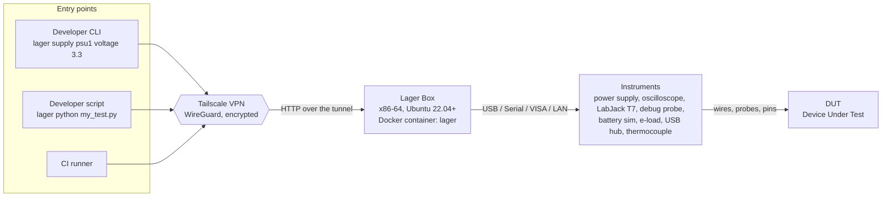
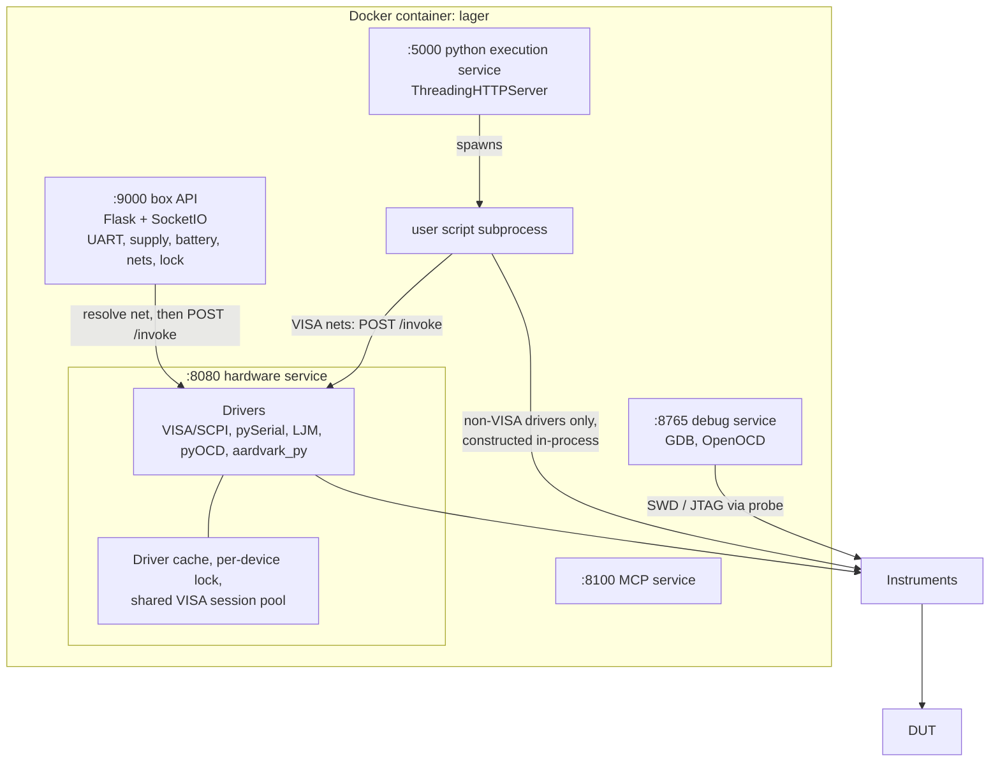
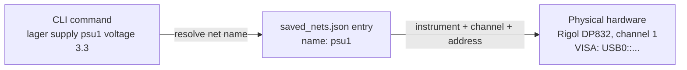
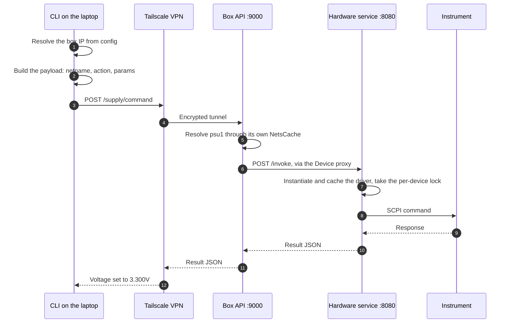
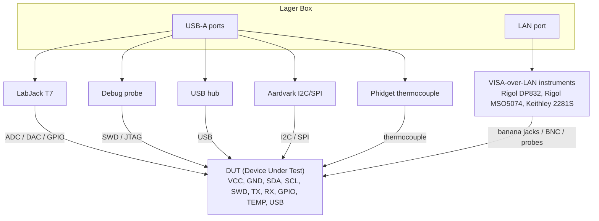

An overview of how the Lager platform components fit together. It runs from the CLI commands on your laptop to the instruments wired to your DUT.

## High-Level Overview



All three entry points reach the box through the same Tailscale tunnel. They end at the same
drivers. Inside the box they take different routes.

A command that drives a net through the box API posts directly to port 9000. `lager supply` is
one. `lager python` instead uploads a script to the execution service on port 5000. That
service runs the script as a subprocess. The subprocess gets full access to the `lager.*`
hardware libraries.

A CI runner is a developer machine that is ephemeral. It uses the same path as the command it
runs.

## Terminology

| Term | Definition |
|------|------------|
| **CLI** | The `lager-cli` Python package (installed via `pip install lager-cli`). A Click-based command-line tool that runs on the developer's laptop. |
| **Tailscale VPN** | A WireGuard-based mesh VPN that creates an encrypted tunnel between the developer's machine and the Lager Box. |
| **Lager Box** | Any x86-64 machine running Ubuntu 22.04 or newer, physically co-located with the test instruments. Runs a Docker container hosting the box services and hardware drivers. |
| **Net** | A logical name (e.g., `psu1`, `uart0`) that maps to a specific instrument + channel + address. Stored in `/etc/lager/saved_nets.json` on the box. |
| **DUT** | Device Under Test -- the embedded board or product being tested. |
| **Instrument** | A piece of test equipment (power supply, oscilloscope, LabJack, debug probe, etc.) connected to the box via USB, serial, or LAN. |
| **`lager python`** | CLI command that uploads a user-written Python script to the box for execution with full access to `lager.*` hardware libraries. |

## Lager Box Internals

```
/etc/lager/
├── saved_nets.json
├── available_instruments.json
├── box_id
└── authorized_keys.d/

~/third_party/
├── JLink_Linux_*/        (optional)
└── customer-binaries/    (optional)
```

A single Docker container named `lager` (started with `--restart always`) runs every service.
The services are **peer processes, not a pipeline**. A start script launches each one and
restarts it if it dies.

Two of them call the hardware service on port 8080. The first is the box API on port 9000.
The second is each user script that the execution service spawns. Both resolve the net name in
their own process, then POST to `/invoke`. The debug and MCP services are independent.

The hardware service is the sole owner of an instrument's VISA session. A caller that opens its
own session races it for the USB device.

A script drives an instrument directly only when it is **not** a VISA instrument. The direct
drivers are LabJack, USB-202, FT232H, Aardvark, Joulescope and PPK2. Supplies, scopes, battery
simulators, e-loads and solar simulators go over `/invoke` like any other caller.



<Note>
  **Each process holds its own `NetsCache`.** It is a per-interpreter singleton, not a box-wide
  one. The box API, the hardware service, and the debug and MCP services each hold one. So does
  every `lager python` subprocess.

  Each copy reads `saved_nets.json` and invalidates on that file's mtime. The copies therefore
  converge on their own. Three consequences follow. Every process pays its own first read. Two
  processes can disagree briefly, between a write and the next read. A service that dies and
  restarts comes back with a cold cache.
</Note>

### Port Summary

| Port | Service | Exposed | Purpose |
|------|---------|---------|---------|
| 9000 | Flask + SocketIO | Yes (VPN only) | Main box API: UART streaming, live supply/battery WebSockets, instrument discovery, net listing, box lock |
| 5000 | HTTP | Yes (VPN only) | Python execution service: receives uploaded scripts and runs them as subprocesses |
| 8765 | WebSocket | Yes (VPN only) | Debug sessions (GDB, flash, reset) |
| 8100 | HTTP | Yes (VPN only) | MCP service for AI tool integration |
| 8080 | Flask | Yes (VPN only) | Hardware service: instrument control via the Device proxy, called by the port 9000 API |
| 8081 | HTTP | Yes (if PicoScope present) | Oscilloscope streaming UI |
| 8082-8085 | TCP / WebSocket | Yes (if PicoScope present) | Oscilloscope daemon (commands, browser streaming, database streaming, CLI WebSocket) |
| 8086+ | HTTP | Yes (if webcams present) | Webcam MJPEG streaming (one port per camera) |
| 22 | SSH | Yes | Direct SSH access for deployment and debugging |

<Note>
  The **Exposed** column describes a box that publishes its ports, which is the default. A box
  started with `start_box.sh --no-publish` (or `LAGER_NO_PUBLISH=1`) publishes none of them.
  Every service still listens inside the container. The `lagernet` Docker network still reaches
  it, and a reverse proxy owns the host ports. No `Yes` row answers at `<box-ip>:<port>`.

  Port 22 is the exception. SSH is the host's own daemon rather than a published container port,
  so `--no-publish` does not affect it.
</Note>

### Why there are two HTTP ports

A box answers on `:9000` and on `:5000`, and the split is historical rather than
functional.

`:9000` is the box API and the primary one. Net metadata, instrument discovery,
box locking, file download and version reporting all go there.

`:5000` is the older script-upload path. `lager python` still uses it to send a
script to the box and to stop a running one. Nothing new is added to it.

Some state answers on both. Lock state is one: the box exposes it on each
server, and the CLI reads it from `:9000`.

Open both to your VPN. A box that publishes only `:9000` answers `lager nets`
and `lager hello` but fails `lager python`.

## Optional Control Plane Integration

A Lager Box publishes SSH keys from a key directory, `/etc/lager/authorized_keys.d/`. An external control plane can therefore provision access with no human typing SSH commands. Put a `<name>.pub` file there, and the key reaches the box account's `~/.ssh/authorized_keys` in about five seconds. The box bind-mounts `/etc/lager` into the runtime container, so a control plane can write that file from inside the container. That is how it bootstraps before it has any SSH access to the box.

`start_box.sh` owns only the region of `authorized_keys` between its `# BEGIN LAGER MANAGED KEYS` and `# END LAGER MANAGED KEYS` markers. It rebuilds that region from the key directory on every pass. Two consequences follow:

- **Deleting a `.pub` revokes the key.** Nothing else does; editing `authorized_keys` by hand inside the marked region is undone on the next pass.
- **Keys installed by other means stay untouched.** `ssh-copy-id` and cloud-init append outside the marked region, and `start_box.sh` preserves those lines verbatim. Any other system that manages this file must claim its own distinct marker pair. Two managers that share one pair each rebuild the other's region on every pass.
- **Preserved is not the same as durable.** `start_box.sh` preserves a loose line against *its own* rebuild. It cannot preserve that line against someone else's.

  A second key manager rebuilds `authorized_keys` from its own source. It keeps only its own marked region, so it drops every loose line. `start_box.sh` then re-creates its region from the key directory alone. A key that never reached that directory does not come back.

  For this reason `lager ssh-setup`, `lager update`, and `lager install` do both. They append the public key, and they write it into the key directory as `lager-box-<user>-<host>.pub`. Any tool that installs a key it expects to survive must do the same.

Lager itself does not require or run a control plane -- this is a hook, not a dependency. Leaving the key directory absent or empty simply means no keys are published from it.

The [Professional Services directory](https://lagerdata.com/professional-services) lists the commercial control planes that build on this hook. They add org, RBAC and SSO, audit logging, and scheduling on top of Lager.

## Net Abstraction

A **Net** is the central abstraction that decouples CLI commands from physical hardware details.



The record backing `psu1` looks like this:

```json
{
  "name": "psu1",
  "type": "power-supply",
  "channel": 1,
  "instrument": {
    "name": "rigol-dp832",
    "address": "USB0::0x1AB1::0x0E11::..."
  },
  "params": {
    "voltage_limit": 5.0
  }
}
```

Swapping the physical supply means editing this record. Every command that names `psu1` keeps
working.

### Supported Net Types

| Net Type | Instruments |
|----------|-------------|
| `power-supply` | Rigol DP800, Keithley 2200/2280, Keysight E36x00 |
| `battery` | Keithley 2281S |
| `eload` | Rigol DL3021 |
| `solar` | EA PSI / EL series |
| `analog` | Rigol MSO5000 (oscilloscope analog channel) |
| `logic` | Rigol MSO5000 (logic analyzer channel) |
| `adc` | LabJack T7, USB-202 |
| `dac` | LabJack T7, USB-202 |
| `gpio` | LabJack T7, USB-202 |
| `thermocouple` | Phidget thermocouple |
| `watt` | Yocto-Watt, Joulescope JS220 |
| `debug` | J-Link, CMSIS-DAP, ST-Link (via pyOCD) |
| `uart` | USB-to-serial adapters |
| `i2c` | Aardvark, LabJack T7, FT232H |
| `spi` | LabJack T7, FT232H |
| `arm` | Rotrics Dexarm |
| `usb-hub` | Acroname, YKUSH |

## Execution Flows

### CLI Command Execution

Step-by-step data path for `lager supply psu1 voltage 3.3 --yes`:



The hardware service owns and caches the driver for each physical device. It serializes access
under a per-device lock. Concurrent requests to the box API cannot interleave I/O on the same
instrument.

### Custom Script Execution (`lager python`)

The `lager python` command uploads a user-written Python script to the execution service on
port 5000. This is a different path from the box API commands above. The service runs the
script as its own subprocess, with its own interpreter and its own caches.

What happens next depends on the instrument. A VISA instrument goes through the same `/invoke`
proxy the box API uses. That covers supplies, scopes, battery simulators, e-loads and solar
simulators. Everything else is constructed and driven inside the subprocess: LabJack, USB-202,
FT232H, Aardvark, Joulescope and PPK2.

Those direct-USB drivers claim their device exclusively. The execution service therefore asks
the hardware service to release its own claims first. It leaves the shared VISA sessions open
on purpose. Tearing those down is what produced `[Errno 16] Resource busy` on the next supply
command.

```bash
$ lager python my_test.py --box mybox --env VOLTAGE=3.3 --timeout 300
```

The script runs inside the Docker container with full access to the `lager.*` hardware libraries. The box streams its output back in real time.

## Physical Wiring

How instruments physically connect between the Lager Box and the DUT:



### Connection Types

| Connection | Used For | Protocol |
|------------|----------|----------|
| USB | LabJack, debug probes, serial, hubs | Vendor-specific, CDC-ACM |
| USB-VISA | Rigol/Keithley/Keysight instruments | USBTMC (SCPI) |
| LAN-VISA | Bench instruments on local network | VXI-11 / raw TCP (SCPI) |
| Serial (UART) | DUT communication | RS-232 / TTL via USB adapter |
| SWD / JTAG | Firmware flash, debug, reset | ARM debug (via probe) |
| I2C / SPI | Peripheral communication with DUT | I2C / SPI via Aardvark or LabJack |

## Running from CI

A CI runner drives a Lager Box with the same commands a developer uses. Lager
needs no CI-specific infrastructure.

There are two arrangements. A runner on a separate host reaches the box across
the network, usually over a Tailscale VPN. A runner installed on the box needs
no network hop and no secrets. It also serializes the jobs for that bench.

[Using Lager in CI](/source/getting-started/using-lager-in-ci) covers both
arrangements and the workflow for each. It also covers bench locking, firmware
delivery, and cleanup after a cancelled job.
