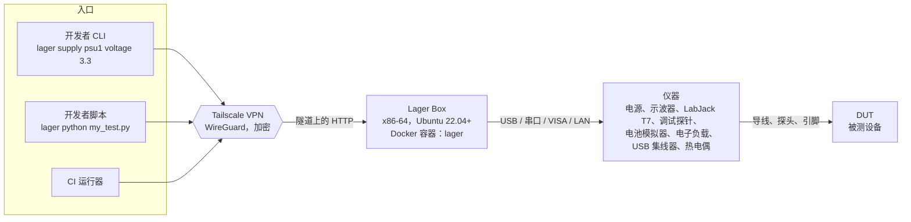
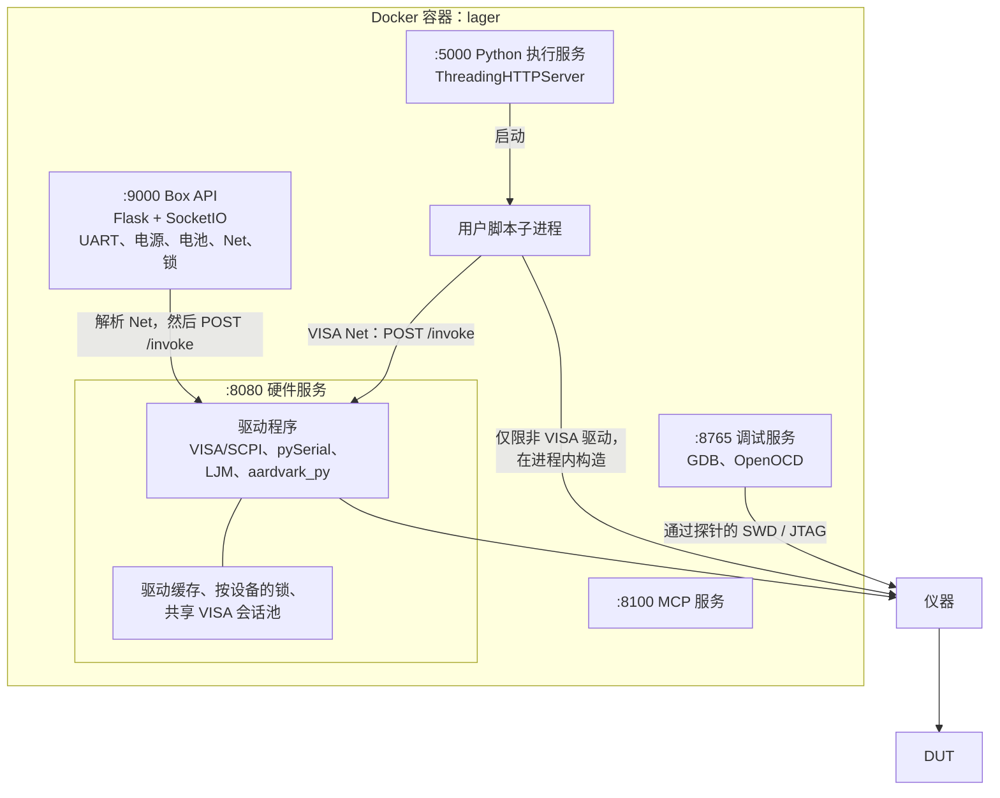
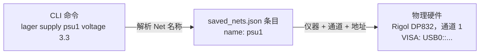
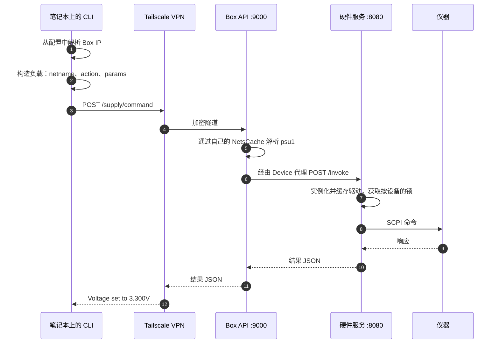
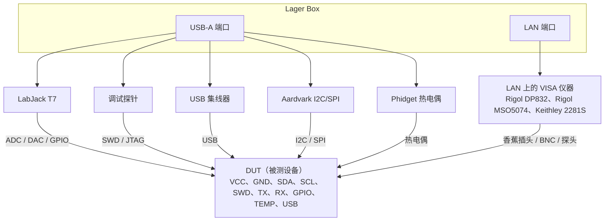

本页概述 Lager 平台的各个组件如何协同工作，从您笔记本上的 CLI 命令，一直到接在被测设备（DUT）上的仪器。

## 总体概览



这三个入口都通过同一条 Tailscale 隧道到达 Box，最终都落到同一批驱动程序上。但在 Box 内部，
它们走的路径不同。

通过 Box API 驱动 Net 的命令直接 POST 到端口 9000，`lager supply` 就是其中之一。
`lager python` 则把脚本上传到端口 5000 上的执行服务。该服务把脚本作为子进程运行，
子进程可以完整访问 `lager.*` 硬件库。

CI 运行器就是一台临时的开发者计算机。它使用与所运行命令相同的路径。

## 术语

| 术语 | 定义 |
|------|------|
| **CLI** | `lager-cli` Python 包（通过 `pip install lager-cli` 安装）。一个基于 Click 的命令行工具，运行在开发者的笔记本上。 |
| **Tailscale VPN** | 一种基于 WireGuard 的网状 VPN，在开发者的计算机和 Lager Box 之间建立加密隧道。 |
| **Lager Box** | 任意一台运行 Ubuntu 22.04 或更新版本的 x86-64 计算机，与测试仪器放在同一地点。它运行一个 Docker 容器，容器中承载 Box 服务和硬件驱动程序。 |
| **Net** | 一个逻辑名称（例如 `psu1`、`uart0`），映射到具体的仪器 + 通道 + 地址。保存在 Box 的 `/etc/lager/saved_nets.json` 中。 |
| **DUT** | 被测设备（Device Under Test）—— 正在测试的嵌入式电路板或产品。 |
| **仪器** | 通过 USB、串口或 LAN 连接到 Box 的测试设备（电源、示波器、LabJack、调试探针等）。 |
| **`lager python`** | 把用户编写的 Python 脚本上传到 Box 执行的 CLI 命令，脚本可以完整访问 `lager.*` 硬件库。 |

## Lager Box 内部结构

```
/etc/lager/
├── saved_nets.json
├── available_instruments.json
├── box_id
└── authorized_keys.d/

~/third_party/
├── JLink_Linux_*/        (可选)
└── customer-binaries/    (可选)
```

一个名为 `lager` 的 Docker 容器（用 `--restart always` 启动）运行全部服务。
这些服务是**平级的进程，而不是一条流水线**。一个启动脚本逐个启动它们，并在它们退出时重启它们。

其中两方会调用端口 8080 上的硬件服务。第一方是端口 9000 上的 Box API。第二方是执行服务
启动的每个用户脚本。两者都在自己的进程中解析 Net 名称，然后 POST 到 `/invoke`。
调试服务和 MCP 服务是独立的。

硬件服务是仪器 VISA 会话的唯一拥有者。自行打开会话的调用方会与它争抢该 USB 设备。

只有当仪器**不是** VISA 仪器时，脚本才会直接驱动它。直连驱动包括 LabJack、USB-202、
FT232H、Aardvark、Joulescope 和 PPK2。电源、示波器、电池模拟器、电子负载和太阳能模拟器
与其他调用方一样，都经过 `/invoke`。



<Note>
  **每个进程各自持有自己的 `NetsCache`。** 它是每个解释器一个的单例，而不是整台 Box 一个。
  Box API、硬件服务、调试服务和 MCP 服务各持有一个，每个 `lager python` 子进程也是如此。

  每份副本都读取 `saved_nets.json`，并根据该文件的 mtime 失效。因此这些副本会自行收敛。
  由此产生三个后果：每个进程都要自己承担第一次读取的开销；在一次写入和下一次读取之间，
  两个进程可能短暂地不一致；一个崩溃并重启的服务会带着冷缓存回来。
</Note>

### 端口一览

| 端口 | 服务 | 是否暴露 | 用途 |
|------|---------|-------|------|
| 9000 | Flask + SocketIO | 是 | 主 Box API：UART 串流、电源/电池实时 WebSocket、仪器发现、Net 列表、Box 锁。设置了 `LAGER_DISABLE_UART_SERVICE` 时不发布 |
| 5000 | HTTP | 是 | Python 执行服务：接收上传的脚本并以子进程运行 |
| 8301 | HTTP | 是 | 端口 5000 的别名，为向后兼容而保留 |
| 8765 | WebSocket | 是 | 调试会话（GDB、烧录、复位） |
| 8100 | HTTP | 是 | 用于 AI 工具集成的 MCP 服务 |
| 8080 | Flask | 是 | 硬件服务：通过 Device 代理控制仪器，由端口 9000 的 API 调用 |
| 8081 | HTTP | 是（存在 PicoScope 时） | 示波器串流 UI |
| 8082-8085 | TCP / WebSocket | 是（存在 PicoScope 时） | 示波器守护进程（命令、浏览器串流、数据库串流、CLI WebSocket） |
| 8086-8090 | HTTP | 是（存在摄像头时） | 摄像头 MJPEG 串流（每个摄像头一个端口，从 8086 开始） |
| 2331-2342 | TCP | 是 | 调试探针的 GDB、SWO 和 telnet 端口，每个探针三个 |
| 4444-4447 | TCP | 是 | OpenOCD telnet，每个探针一个 |
| 6666-6669 | TCP | 是 | OpenOCD TCL，每个探针一个 |
| 9090-9097 | TCP | 是 | RTT，每个探针两个 |
| 22 | SSH | 是 | 用于部署和调试的直接 SSH 访问 |

<Warning>
  **主机防火墙不会过滤已发布的端口。** Docker 把它的转发规则装在主机链之前。因此，
  无论 `ufw status` 报告什么，一个已发布的端口都会响应任何能路由到该 Box 的人。
  请把网络可达性当作边界，把 Box 放在 VPN 上或隔离的局域网中。请参阅
  [SECURITY.md](https://github.com/lagerdata/lager/blob/main/SECURITY.md#security-model) 的
  Security Model 部分。
</Warning>

<Note>
  **是否暴露**这一列描述的是发布端口的 Box，这是默认行为。用 `start_box.sh --no-publish`
  （或 `LAGER_NO_PUBLISH=1`）启动的 Box 不发布其中任何端口。所有服务仍然在容器内监听，
  `lagernet` Docker 网络仍然可以访问它们，主机端口则由反向代理拥有。此时没有任何标记为
  "是" 的行会在 `<box-ip>:<port>` 上响应。

  端口 22 是例外。SSH 是主机自己的守护进程，而不是容器发布的端口，因此 `--no-publish`
  对它没有影响。

  设置了 `lager box-config network-mode host` 的 Box 同样不发布端口。在那种模式下，
  容器直接在主机上绑定端口，由主机防火墙管辖它们。
</Note>

### 为什么有两个 HTTP 端口

Box 在 `:9000` 和 `:5000` 上都响应，这个划分是历史原因造成的，而不是功能上的区别。

`:9000` 是 Box API，也是主要端口。Net 的元数据、仪器发现、Box 锁定、文件下载和版本报告
都走这里。

`:5000` 是更早的脚本上传路径。`lager python` 仍然用它把脚本发送到 Box，以及停止正在运行的脚本。
不会再往它上面添加新功能。

有些状态在两个端口上都能查到。锁状态就是其中之一：Box 在每个服务器上都暴露它，而 CLI 从
`:9000` 读取。

请让这两个端口都能通过您的 VPN 访问。只发布 `:9000` 的 Box 能响应 `lager nets` 和
`lager hello`，但 `lager python` 会失败。

## 可选的控制平面集成

Lager Box 会从一个密钥目录 `/etc/lager/authorized_keys.d/` 发布 SSH 密钥。因此，
外部控制平面可以在无人手动输入 SSH 命令的情况下开通访问权限。把一个 `<name>.pub` 文件放进去，
该密钥会在大约五秒内进入 Box 账户的 `~/.ssh/authorized_keys`。Box 把 `/etc/lager`
绑定挂载到运行时容器中，因此控制平面可以从容器内部写入该文件。它就是这样在还没有任何 SSH
访问权限时完成自举的。

`start_box.sh` 只拥有 `authorized_keys` 中位于它的 `# BEGIN LAGER MANAGED KEYS` 和
`# END LAGER MANAGED KEYS` 标记之间的区域。它每一轮都会根据密钥目录重建该区域。
由此产生两个后果：

- **删除一个 `.pub` 就是吊销该密钥。** 没有别的方法能做到；在标记区域内手动编辑
  `authorized_keys`，会在下一轮被撤销。
- **通过其他方式安装的密钥不受影响。** `ssh-copy-id` 和 cloud-init 追加在标记区域之外，
  `start_box.sh` 会原样保留这些行。任何其他管理该文件的系统都必须使用自己独立的一对标记。
  共用同一对标记的两个管理者，每一轮都会重建对方的区域。
- **被保留不等于持久。** `start_box.sh` 保护零散的行不被**它自己**的重建删除，
  但它无法保护那一行不被别人删除。

  第二个密钥管理者会根据它自己的来源重建 `authorized_keys`。它只保留自己的标记区域，
  因此会丢弃所有零散的行。随后 `start_box.sh` 只会根据密钥目录重建它自己的区域。
  从未进入过该目录的密钥不会回来。

  因此，`lager ssh-setup`、`lager update` 和 `lager install` 两件事都做：它们追加公钥，
  同时把它以 `lager-box-<user>-<host>.pub` 的名称写入密钥目录。任何希望所装密钥能够留存的
  工具，都必须这样做。

Lager 本身不要求也不运行控制平面 —— 这是一个挂钩，不是依赖。密钥目录不存在或为空，
只意味着不从它发布任何密钥。

[专业服务目录](https://lagerdata.com/professional-services) 列出了基于这个挂钩构建的商业控制平面。
它们在 Lager 之上增加了组织管理、RBAC 和 SSO、审计日志以及调度功能。

## Net 抽象

**Net** 是把 CLI 命令与物理硬件细节解耦的核心抽象。



`psu1` 背后的记录是这样的：

```json
{
  "name": "psu1",
  "type": "power-supply",
  "channel": 1,
  "instrument": {
    "name": "rigol-dp832",
    "address": "USB0::0x1AB1::0x0E11::..."
  },
  "params": {
    "voltage_limit": 5.0
  }
}
```

更换物理电源只需要编辑这条记录。每一条使用 `psu1` 的命令都继续有效。

### 受支持的 Net 类型

| Net 类型 | 仪器 |
|----------|-------------|
| `power-supply` | Rigol DP800、Keithley 2200/2280、Keysight E36x00 |
| `battery` | Keithley 2281S |
| `eload` | Rigol DL3021 |
| `solar` | EA PSI / EL 系列 |
| `analog` | Rigol MSO5000（示波器模拟通道） |
| `logic` | Rigol MSO5000（逻辑分析仪通道） |
| `adc` | LabJack T7、LabJack U3、USB-202 |
| `dac` | LabJack T7、LabJack U3、USB-202 |
| `gpio` | LabJack T7、LabJack U3、USB-202 |
| `thermocouple` | Phidget 热电偶 |
| `watt` | Yocto-Watt、Joulescope JS220 |
| `debug` | J-Link（J-Link GDB 服务器）；ST-Link、CMSIS-DAP 和 FTDI 调试适配器（OpenOCD） |
| `uart` | USB 转串口适配器 |
| `i2c` | Aardvark、LabJack T7、LabJack U3、FT232H |
| `spi` | LabJack T7、LabJack U3、FT232H |
| `arm` | Rotrics Dexarm |
| `usb-hub` | Acroname、YKUSH、Plugable |

## 执行流程

### CLI 命令的执行

`lager supply psu1 voltage 3.3 --yes` 的逐步数据路径：



硬件服务拥有并缓存每台物理设备的驱动程序。它在按设备的锁下串行化访问。
因此，对 Box API 的并发请求不会在同一台仪器上交错进行 I/O。

### 自定义脚本的执行（`lager python`）

`lager python` 命令把用户编写的 Python 脚本上传到端口 5000 上的执行服务。
这条路径与上面的 Box API 命令不同。该服务把脚本作为独立的子进程运行，
子进程有自己的解释器和自己的缓存。

接下来会发生什么，取决于仪器的类型。VISA 仪器会经过 Box API 使用的同一个 `/invoke` 代理，
这包括电源、示波器、电池模拟器、电子负载和太阳能模拟器。其他仪器都在子进程内部构造和驱动：
LabJack、USB-202、FT232H、Aardvark、Joulescope 和 PPK2。

这些直连 USB 的驱动程序会独占地占用它们的设备。因此，执行服务会先请硬件服务释放它自己的占用。
它故意让共享的 VISA 会话保持打开。拆掉那些会话，正是下一条电源命令出现
`[Errno 16] Resource busy` 的原因。

```bash
$ lager python my_test.py --box mybox --env VOLTAGE=3.3 --timeout 300
```

脚本在 Docker 容器内部运行，可以完整访问 `lager.*` 硬件库。Box 会实时把它的输出回传给您。

## 物理接线

仪器在 Lager Box 和被测设备之间的物理连接方式：



### 连接类型

| 连接 | 用于 | 协议 |
|------------|----------|----------|
| USB | LabJack、调试探针、串口、集线器 | 厂商专有、CDC-ACM |
| USB-VISA | Rigol/Keithley/Keysight 仪器 | USBTMC（SCPI） |
| LAN-VISA | 本地网络上的台式仪器 | VXI-11 / 原始 TCP（SCPI） |
| 串口（UART） | 与被测设备通信 | 通过 USB 适配器的 RS-232 / TTL |
| SWD / JTAG | 固件烧录、调试、复位 | ARM 调试（通过探针） |
| I2C / SPI | 与被测设备的外围通信 | 通过 Aardvark 或 LabJack 的 I2C / SPI |

## 在 CI 中运行

CI 运行器用与开发者相同的命令驱动 Lager Box。Lager 不需要任何 CI 专用的基础设施。

有两种部署方式。位于独立主机上的运行器通过网络访问 Box，通常经由 Tailscale VPN。
安装在 Box 上的运行器不需要网络跳转，也不需要任何密钥，并且它会把该实验台上的作业串行化。

[在 CI 中使用 Lager](/source/zh/getting-started/using-lager-in-ci) 介绍这两种方式及各自的工作流程。
它还涵盖实验台锁定、固件交付，以及作业被取消后的清理。
